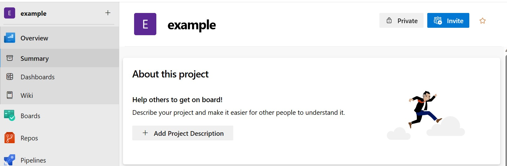
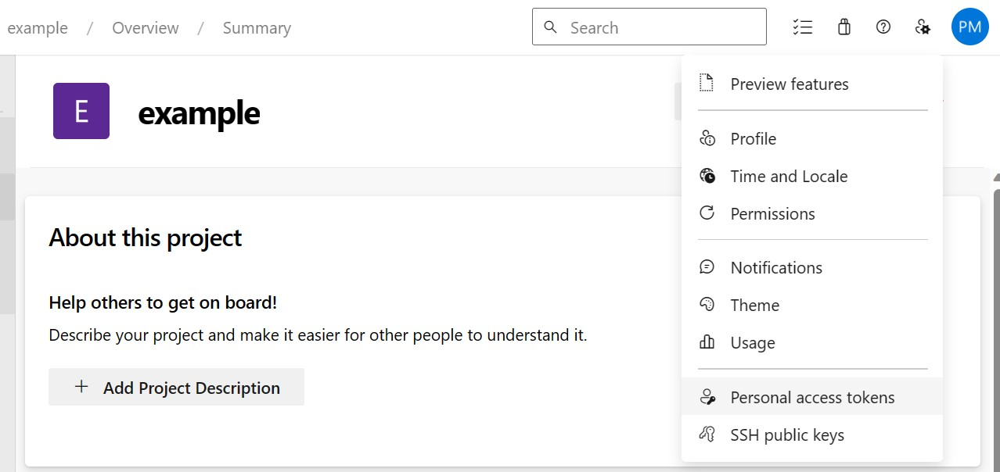
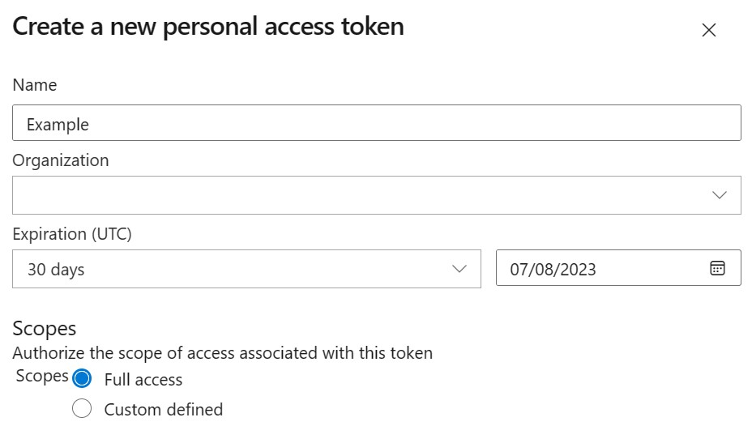
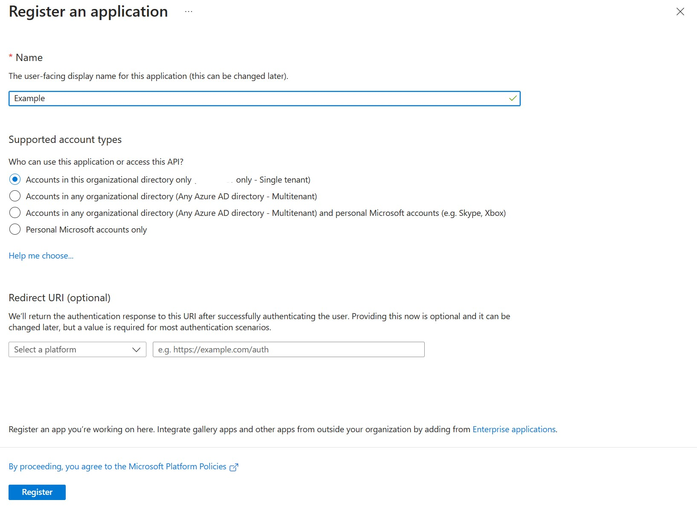
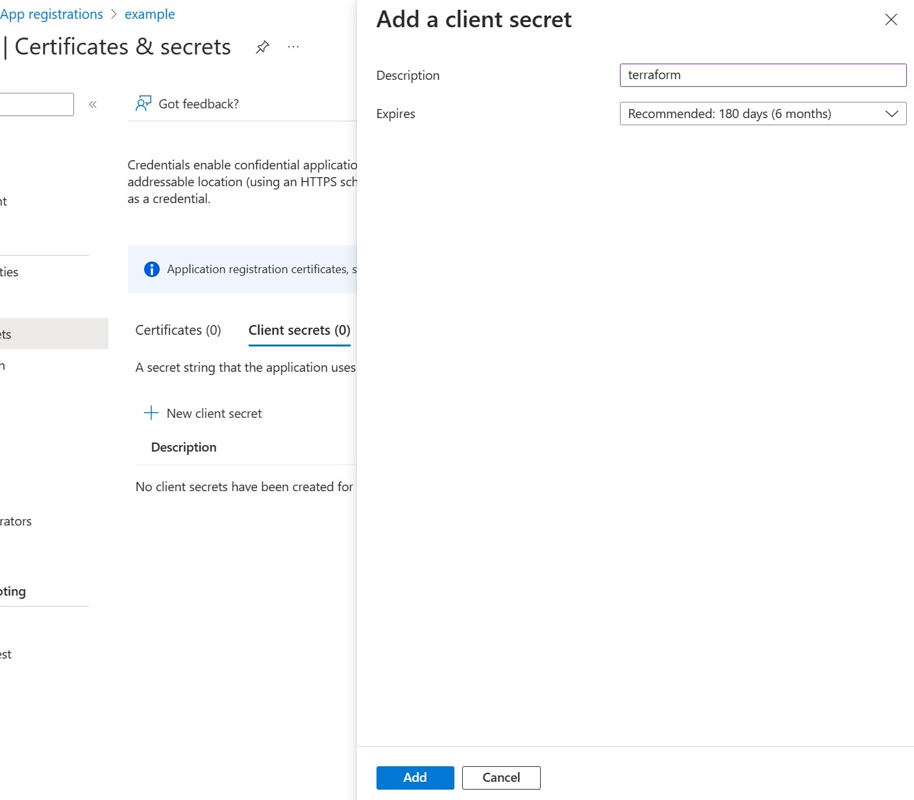
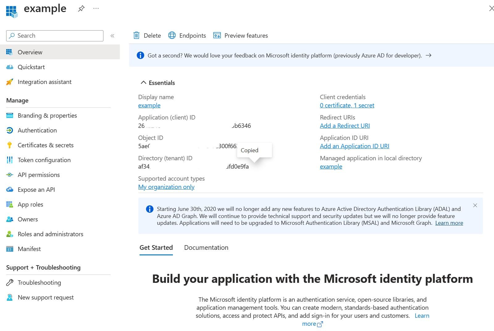
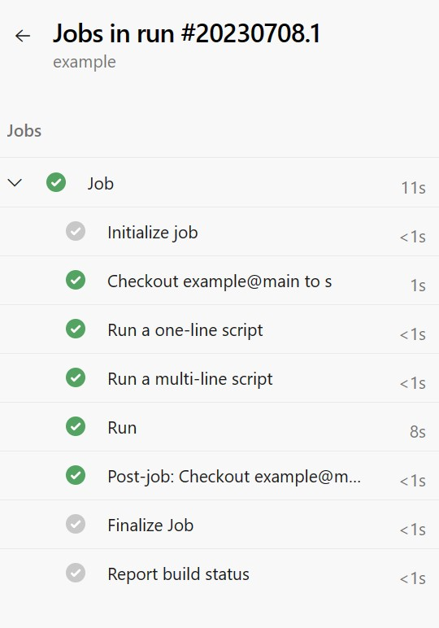
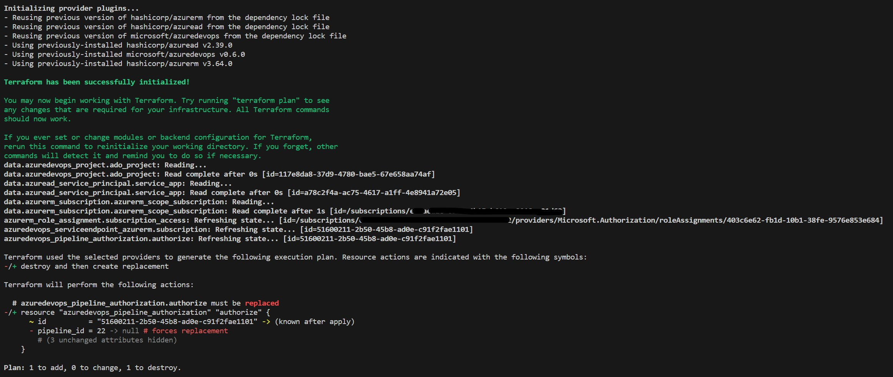

# tf_pipeline_authorization
An example demo to explain an issue I was having.

https://github.com/microsoft/terraform-provider-azuredevops/issues/808


## Steps
### Azure Devops
1. In Azure Devops create a project called Example
   
2. Create a PAT with full access
   - Select `User Settings -> Personal Access Token`
   
   - Fill out a New Personal Access Token and note down the PAT. 

3. Take a note of your DevOps Organization URL. Example `https://dev.azure.com/[org-nam]`

### Azure
1. In Azure Portal, create an App Registration
   1. Go to Azure Active Directory
   2. Under Manage click `App registration`
   3. Click `New registration`
   4. Give it a name of `Example`
   5. Leave as single tenant and click `Register`

2. Create a Secret for the App Registration
   1. While on the app page, under Manage click `Certificates & secrets`
   2. Select the `Client secrets (0)` tab, and click `+ New client secret`
   3. Give it a description, and click Add.
   4. Take a note of the secret
   
   
3. Take down the AppId.
   1. You can find the Application (client) ID on the overview page of the app.
  

4. Go to your subscription and take down the SubscriptionId.


### Running 
1. Log into your Azure Portal using [AZ cli](https://learn.microsoft.com/en-us/cli/azure/install-azure-cli)
   ```ps1
   az login
   ```
2. Run the PowerShell, replacing the values with values you have collected from Azure Devops and Azure.
    ```ps1
    .\run.ps1 `
    -SubscriptionId: "xxxx" `
    -ProjectName: "Example" `
    -AppId: "xxxx" `
    -Secret: "xxxxx" `
    -PAT: "xxxxxxx" `
    -DevOpsOrgUrl: "https://dev.azure.com/[project]"
    ```

3. The following has been deployed:
   -  A service connection between DevOps and your Subscription
   -  Authorization to all pipelines in DevOps
   -  Given the Service principal used Owner access on the Subscription.
    
   If you run the above code again you will get no changes, which is as expected.

### Create a Pipeline.
1. In the Devops project of Example, click `Pipelines`
2. Create new Pipeline using the starter template, and add an Azure CLI task to show the account it's running in. THen run the pipeline.
```hcl
# Starter pipeline
# Start with a minimal pipeline that you can customize to build and deploy your code.
# Add steps that build, run tests, deploy, and more:
# https://aka.ms/yaml

trigger:
- main

pool:
  vmImage: ubuntu-latest

steps:
- script: echo Hello, world!
  displayName: 'Run a one-line script'

- script: |
    echo Add other tasks to build, test, and deploy your project.
    echo See https://aka.ms/yaml
  displayName: 'Run a multi-line script'

- task: AzureCLI@2
  displayName: "Run"
  inputs:
    azureSubscription: "example-sub"
    scriptType: pscore
    scriptLocation: inlineScript
    inlineScript: |
      az account show
```


### Run Terraform again
1. Run the PowerShell, replacing the values with values you have collected from Azure Devops and Azure.
    ```ps1
    .\run.ps1 `
    -SubscriptionId: "xxxx" `
    -ProjectName: "Example" `
    -AppId: "xxxx" `
    -Secret: "xxxxx" `
    -PAT: "xxxxxxx" `
    -DevOpsOrgUrl: "https://dev.azure.com/[project]"
    ```

As you can see from below, the `pipeline_id` has changed to a given pipeline, even though the authorization should be for all pipelines.


If you follow the above steps again, but use
```hcl
resource "azuredevops_resource_authorization" "authorize" {
    project_id = data.azuredevops_project.ado_project.id
    resource_id = azuredevops_serviceendpoint_azurerm.subscription.id
    authorized = true
}
```
Instead of 
```hcl
resource "azuredevops_pipeline_authorization" "authorize" {
  project_id  = data.azuredevops_project.ado_project.id
  resource_id = azuredevops_serviceendpoint_azurerm.subscription.id
  type        = "endpoint"
} 
```
You don't get this issue.